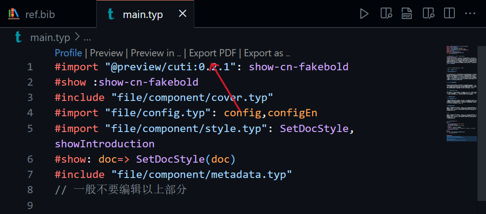

# 北京理工大学学报-Typst模板

本Typst模板依据北京理工大学教育学院许多课程的结课论文要求的 `学报排版格式.pdf` 文件进行制作，方便相关人员进行论文的撰写。Typst是一个类似LaTeX的排版语言，但大大简化了语法，以接近Markdown的语法实现了统一的排版样式。

由于模板基本都已封装好了基本格式，所以不需要深入了解Typst，只需要了解一些基本的标记符号即可进行使用该模板。

要预览导出的PDF论文文件，可参考仓库中的文件 `main.pdf` ，这也是编译后默认导出的文件名。

## 预备工作

如果你对 LaTex、Markdown有一定了解，你可以直接在 VS Code中打开项目，并可以简单地使用 Tinymist Typst 插件编写、编译Typst。

如果你想先了解一下 Typst，你可以在以下网站查阅到更多信息。

[Typst 中文社区导航](https://typst-doc-cn.github.io/guide/)

## 使用方式

### 基本信息（作者、机构等）

`file\config.typ` 文件中保存论文的基本信息。由于标准学报模板中需要英文等信息，所以基本信息部分提供中文、英文两个版本进行修改。

以下是提供的 `config.typ` 文件示例，在未修改模板的样式文件的情况下，删除其中一些字段可能会出现错误。建议使用的时候只需要将相应字段后的内容替换为实际内容即可。

注： Typst 的语法跟 Rust 有所不同，列表使用一对括号 `()` 包裹列表元素。

```rust
#let config = (
  "course": "关于教育的重要论述研究",
  "teachers": ("教师1", "教师2", "教师3"),
  "title": "高校差异化发展：自身实现与外部评估",
  "author": "王小明",
  "university": "清北大学",
  "school": "教育学院",
  "major": "科学与技术教育",
  "sid": "23333333",
  "city": "北京",
  "zipcode": "100000",
  "keywords": ("高校差异化","高校评估","特色学科"),
)

#let configEn = (
  "title": "Differentiated Development of Universities: Self-implementation and External Evaluation",
  "author": "Necthus",
  "university": "Qingbei University",
  "school": "School of Education",
  "city": "Beijing",
  "zipcode": "100000",
  "keywords": ("Differentiated Development of Universities", "University Evaluation", "Characteristic Discipline"),
)
```

### 论文摘要

要填写论文摘要（中文、英文），需要更改以下两个文件：

- `file\abstract.typ`
- `file\abstractEn.typ`

这两个文件都是纯文本形式，只需要将自己的论文摘要填写到文件中即可。

### 论文主体内容

模板的主体内容在 `main.typ` 文件中，同时是论文正文的写作处。不建议修改的部分，参考该文件中的相关注释。

#### 引言

北京理工大学学报的模板中有引言部分，且不纳入标号，所以单独构建，如下

```rust
// 下面可以写引言，也可以删去该段，不写
#showIntroduction()[
“分类推进高校改革发展。实施高等教育综合改革试点。按照研究型、应用型、技能型等基本办学定位，区分综合性、特色化基本方向，明确各类高校发展定位，支持理工农医、人文社科、艺术体育等高校差异化发展。建立分类管理、分类评价机制，在办学条件、招生计划、学位点授权、经费投入等方面分类支持。根据不同类型高校功能定位、实际贡献、特色优势，建立资源配置激励机制，引导高校在不同领域不同赛道发挥优势、办出特色。”@教育强国建设规划纲要
]
```

在 方括号 `[]` 内，删去模板中原有内容，替换为自己的引言内容，即可实现文前的引言。如不需要引言，整体删除上面部分（一整个函数）即可。

#### 带标号的正文

在示例中，正文部分从以下注释开始。

```rust
// 下面是论文的正文内容，可以进行编辑

= 高校差异化的自身实现

== 高校扩大规模的盲目性

在过去的高校发展进程中，部分高校陷入盲目扩大规模的误区，过度聚焦学生数量的攀升与校园面积的拓展，却对自身学科优势与特色视而不见。以20世纪末至21世纪初的高校扩招浪潮为例，诸多高校纷纷投身规模扩张的行列。许多非综合性大学罔顾自身原有优势，急切向综合性大学转型，采取了一系列激进举措。如大量增设专业，且部分专业在教学内容上与校内既有专业高度相似，缺乏独特性与互补性。同时，兼并吸收其他大学，尤其是医学部的现象屡见不鲜。@SHGJ2007Z1027。
```

到以下注释结束。

```rust
= 结论

除构建多元评估体系外，高校的差异化发展离不开外部的有力支持。之所以将支持放在评估中进行讨论，是因为只有正确地建立评估体系，政府才能依据高校的办学定位与特色，实施分类支持策略 。可以说，有效的支持是正确评估的必然结果。
// 到此正文内容结束
```

Typst的语法十分简洁，由于已经预定义好了样式，只需要相关的标记即可定义多级标题，并实现工整的自动标号。类似于Markdown

- 一级标题前添加 `=` （1个等于号）
- 二级标题前添加 `==` （2个等于号）
- 以此类推

当需要使用参考文献时，可以使用标记符 `@` 进行引导。

### 参考文献

参考文献的引文内容位于 `ref.bib` 文件中，为参考文献常用的 BibTex 引用格式。

通常来说，文献检索网站如 Google Scholar、中国知网 都支持导出 BibTex 引用格式，复制到 `ref.bib` 文件中即可。

正文中引用参考文献，使用 `@` 起手进行标注。

### 查重结果截图

在 `main.typ` 文件的最下面，有附上查重结果的代码。可以重命名为 `similarity_check_result.png` ，并放在 `img` 文件夹下，也可以自定义路径（尤其适合于图片扩展名不同的情况）。

```rust
// 在这里编辑查重结果图片的路径
// 通常直接覆盖原图，不改变原文件名即可
#{
  set align(center)
  image("img/similarity_check_result.png")
}
```

### PDF导出

由于 `main.typ` 文件为主文件，并且已包含其余所有组件，只需要编译导出该文件即可。

例如，在VS Code中，可以简单地使用 Tinymist Typst 插件编写Typst，选择 `Export PDF` 选项即可。


